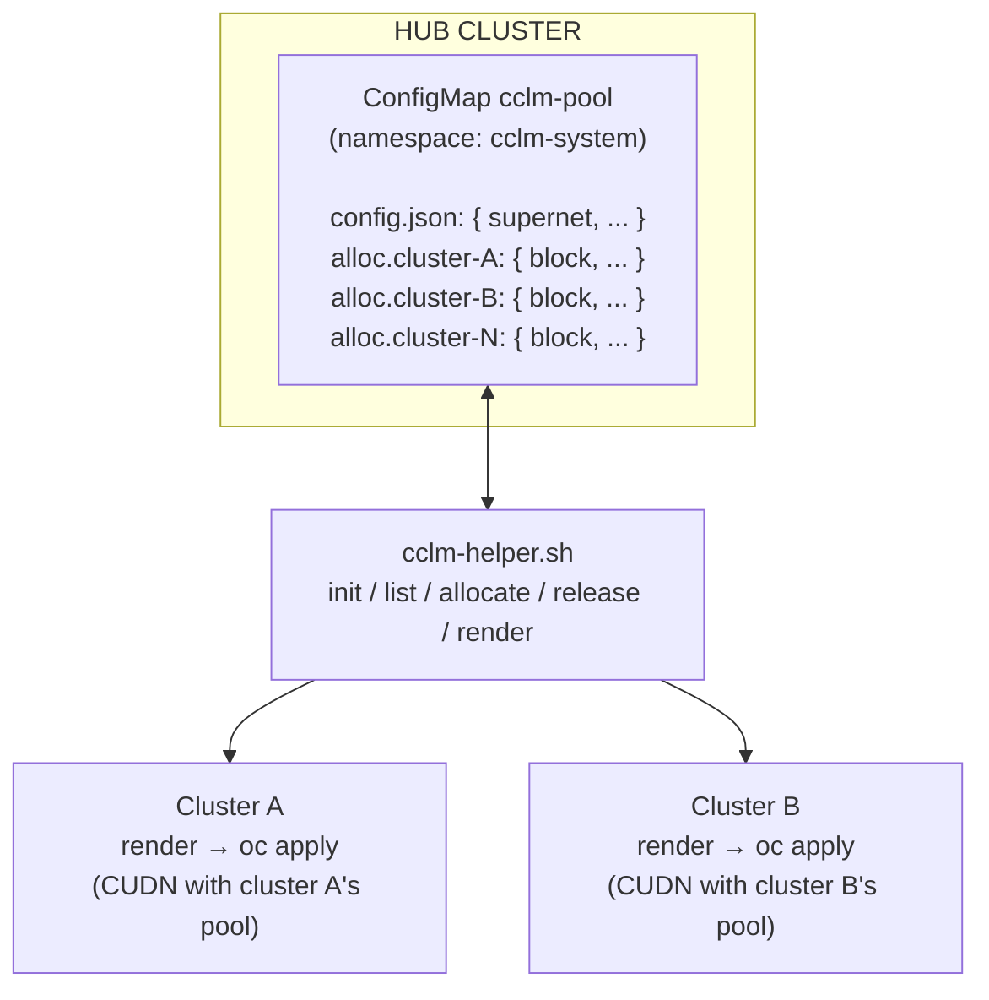

# cclm-helper.sh: Usage Guide

Reference for the `cclm-helper.sh` IPAM allocation helper. For *configuration* of CCLM itself, see `cclm-howto.md` or `cclm-kcs.md`.

---

## 1. What it does

- Maintains a single source of truth (ConfigMap on a hub cluster) of which IPv4 sub-pool each CCLM-participating cluster owns.
- Allocates non-overlapping `/N` blocks from a configured supernet on request.
- Computes the `excludeSubnets` list that the OVN-K `ClusterUserDefinedNetwork` (CUDN) needs to constrain its IPAM to one cluster's sub-pool.
- Renders a ready-to-apply CUDN manifest per cluster.

## 2. What it does NOT do

- Apply manifests to target clusters automatically (you `oc apply` them).
- Create the CCLM Plans/Migrations in MTV (that's a Forklift concern).
- Coordinate the actual cutover (HCO patch, virt-handler rollout) : see the how-to for those steps.
- Manage multiple supernets simultaneously (one supernet per pool).
- Detect cluster deletion automatically (call `release` manually).
- Handle locking against concurrent invocations (low-traffic ops, not expected to be a problem; see [§10](#10-concurrency) if it is).

## 3. Mental model



The hub cluster is just where the state lives. It can be the management cluster, the same cluster as cluster A, or any cluster where you have admin access. The helper itself is stateless: all state is in the ConfigMap.

## 4. Setup

### 4.1 Requirements

- bash 4+
- `jq`
- `python3` with `ipaddress` (stdlib, always available)
- `oc` or `kubectl` (configurable via `KUBECTL` env var)

Verify locally:

```bash
bash --version | head -1
jq --version
python3 -c 'import ipaddress; print("ok")'
oc version --client
```

### 4.2 Install

```bash
chmod +x cclm-helper.sh
sudo install cclm-helper.sh /usr/local/bin/   # or keep it in repo and ./cclm-helper.sh
```

### 4.3 Environment variables

| Var | Default | Purpose |
|---|---|---|
| `KUBECONFIG` | `~/.kube/config` | Which cluster holds the state ConfigMap |
| `CCLM_NAMESPACE` | `cclm-system` | Namespace of the state ConfigMap |
| `CCLM_CONFIGMAP` | `cclm-pool` | Name of the state ConfigMap |
| `KUBECTL` | `oc` | Use `kubectl` if `oc` unavailable |

Recommended pattern: set `KUBECONFIG=<hub-kubeconfig>` once at the start of a session and run helper from that shell. Render output goes to stdout regardless; apply with a *different* kubeconfig.

## 5. Subcommand reference

### 5.1 `init [supernet] [block_size] [vlan]`

Creates the namespace and the empty pool ConfigMap. Idempotent: if the ConfigMap already exists, prints the current config and exits 0.

```bash
./cclm-helper.sh init 10.250.0.0/16 26 100
```

| Argument | Default | Notes |
|---|---|---|
| `supernet` | `10.250.0.0/16` | The full address range the pool owns |
| `block_size` | `26` | Mask size for per-cluster sub-pools (e.g. `/26` = 62 hosts) |
| `vlan` | `100` | Default VLAN ID propagated to per-cluster CUDNs |

Output (first run):

```
Initialized cclm-system/cclm-pool
  supernet:    10.250.0.0/16
  block_size:  /26  (64 IPs per cluster)
  capacity:    1024 clusters max
  vlan_default: 100
```

To change pool config later: edit the ConfigMap directly (`oc edit configmap cclm-pool -n cclm-system`): `init` only initializes, not reconfigures.

### 5.2 `list`

Prints current config + all allocations.

```bash
./cclm-helper.sh list
```

```bash
Config:
  supernet:               10.250.0.0/16
  block_size:             /26
  vlan_default:           100
  physical_network_default: cclm-mig
```

```bash
Allocations:
  hosting-cluster-1:   10.250.0.0/26    vlan=100  model=stretched_l2
  hosted-cluster-a:  10.250.0.64/26   vlan=100  model=stretched_l2
```

### 5.3 `allocate <cluster-id> [model] [vlan]`

Allocates the next free block to `cluster-id`. Idempotent: re-running with the same `cluster-id` returns the existing block (no-op).

| Argument | Default | Notes |
|---|---|---|
| `cluster-id` | (required) | Stable identifier: recommend `<role>-<deployment-name>` (e.g. `hosted-cluster-a`). Used as ConfigMap key, must match `[a-zA-Z0-9-]+`. |
| `model` | `stretched_l2` | Either `stretched_l2` (L2-only, supernet pattern) or `l3_routed` (per-cluster /N with gateway) |
| `vlan` | (default from pool) | Override per-cluster |

Examples:

Standard case: stretched L2, default VLAN

```bash
./cclm-helper.sh allocate hosting-cluster-1
```

Override VLAN for an offshore cluster on a different VLAN

```bash
./cclm-helper.sh allocate hosted-remote-site-1 stretched_l2 200
```

L3-routed model (different DC, has router on migration VLAN)

```bash
./cclm-helper.sh allocate hosted-remote-site-2 l3_routed 300
```

Output:

```
hosting-cluster-1: allocated 10.250.0.0/26 (vlan=100, model=stretched_l2)
```

Or, if pool is exhausted:

```
ERROR: pool 10.250.0.0/16 exhausted at /26 (current alloc count: 1024)
```

(Exit code 1.)

**Allocator behavior:** picks the *first* free block in numerical order. Predictable and reproducible: destroying and re-creating the state with the same cluster-ids in the same order produces identical allocations. If you need specific assignments (e.g. reserve `10.250.99.0/26` for "test cluster"), allocate test cluster *first* or edit the ConfigMap directly.

### 5.4 `release <cluster-id>`

Frees a cluster's allocation. The block becomes available for the next `allocate`.

```bash
./cclm-helper.sh release hosted-remote-site-1
```

Output:

```
hosted-remote-site-1: released 10.250.0.128/26
```

If the cluster doesn't have an allocation, prints "no allocation found (no-op)" and exits 0.

**Important: release does NOT delete the CUDN on the target cluster.** The state in the hub forgets the assignment, but the CUDN on the cluster stays around (and pods keep their IPs). To fully decommission:

1. release from hub (frees the slot for reuse)

```bash
./cclm-helper.sh release hosted-remote-site-1
```

2. delete CUDN on the target (releases pod IPs)

```bash
KUBECONFIG=<remote-site-1> oc delete clusteruserdefinednetwork cclm-migration
```

3. revert HCO if you no longer want CCLM on that cluster

```bash
KUBECONFIG=<remote-site-1> oc patch hyperconverged kubevirt-hyperconverged \
  -n openshift-cnv --type=merge -p '{"spec":{"liveMigrationConfig":{"network":""}}}'
```

### 5.5 `render <cluster-id> [nad-name]`

Prints the CUDN manifest for `cluster-id` to stdout. Does not apply.

| Argument | Default | Notes |
|---|---|---|
| `cluster-id` | (required) | Must already be allocated |
| `nad-name` | `cclm-migration` | Name of the CUDN (and the auto-generated NAD). Use `cclm-migration-v2` etc for blue-green deploys |

The `model` (`stretched_l2` or `l3_routed`) was set at `allocate` time and determines which template renders.

Stretched L2 (default model)

```bash
./cclm-helper.sh render hosting-cluster-1
```

Blue-green: render a new CUDN with a different name

```bash
./cclm-helper.sh render hosting-cluster-1 cclm-migration-v2
```

`stretched_l2` output (snippet):

```yaml
apiVersion: k8s.ovn.org/v1
kind: ClusterUserDefinedNetwork
metadata:
  name: cclm-migration
spec:
  ...
  network:
    topology: Localnet
    localnet:
      role: Secondary
      physicalNetworkName: cclm-mig
      subnets: ["10.250.0.0/16"]
      excludeSubnets:
        - "10.250.128.0/17"
        - "10.250.64.0/18"
        - ... (10 entries, computed)
      vlan:
        mode: Access
        access:
          id: 100
      ipam:
        mode: Enabled
        lifecycle: Persistent
```

`l3_routed` output (snippet):

```yaml
spec:
  network:
    topology: Localnet
    localnet:
      subnets: ["10.250.0.192/26"]    # only this cluster's /26
      # NO excludeSubnets: pods only see /26 as on-link
      vlan:
        mode: Access
        access:
          id: 200
      ipam:
        mode: Enabled
        lifecycle: Persistent
# Header comment notes: gateway 10.250.0.193 must be configured on
# the migration VLAN's router by the network team.
```

## 6. Common workflows

### 6.1 First-time fleet setup

```bash
export KUBECONFIG=~/.kube/hub-config
```

Once

```bash
./cclm-helper.sh init
```

Allocate per cluster

```bash
./cclm-helper.sh allocate hosting-cluster-1
./cclm-helper.sh allocate hosted-cluster-a
./cclm-helper.sh allocate hosted-app-prod
```

Render and apply each

```bash
./cclm-helper.sh render hosting-cluster-1    | KUBECONFIG=~/.kube/hosting-cluster-1    oc apply -f -
./cclm-helper.sh render hosted-cluster-a   | KUBECONFIG=~/.kube/hosted-cluster-a  oc apply -f -
./cclm-helper.sh render hosted-app-prod  | KUBECONFIG=~/.kube/app-prod oc apply -f -
```

Now apply the rest of the CCLM config (HCO patch, MTV gate) per the how-to


### 6.2 Onboarding a new cluster

```bash
export KUBECONFIG=~/.kube/hub-config
./cclm-helper.sh allocate hosted-new-cluster
./cclm-helper.sh render hosted-new-cluster | KUBECONFIG=~/.kube/new-cluster oc apply -f -
```

Then patch HCO + enable MTV gate on new-cluster per the how-to


### 6.3 Decommissioning a cluster

On the target: drain virt-handlers off CCLM first to avoid in-flight migrations breaking

```bash
KUBECONFIG=~/.kube/old-cluster oc patch hyperconverged kubevirt-hyperconverged \
  -n openshift-cnv --type=merge -p '{"spec":{"liveMigrationConfig":{"network":""}}}'
```

Wait for virt-handler rollout

```bash
KUBECONFIG=~/.kube/old-cluster oc rollout status daemonset/virt-handler -n openshift-cnv
```

Delete CUDN

```bash
KUBECONFIG=~/.kube/old-cluster oc delete clusteruserdefinednetwork cclm-migration
```

Release from hub

```bash
KUBECONFIG=~/.kube/hub-config ./cclm-helper.sh release hosted-old-cluster
```

### 6.4 Re-render after losing the YAML

The state ConfigMap is the source of truth. If you lost the rendered YAML for an existing cluster, just re-render: the result is byte- identical.

```bash
./cclm-helper.sh render hosted-cluster-a > restored.yaml
diff restored.yaml previous-known-good.yaml   # should be empty
```

### 6.5 Blue-green CUDN deploy on an existing cluster

Render a SECOND CUDN with a different name, same allocation

```bash
./cclm-helper.sh render hosting-cluster-1 cclm-migration-v2 | \
  KUBECONFIG=~/.kube/hosting-cluster-1 oc apply -f -
```

Switch HCO to v2 (KubeVirt rolls virt-handlers automatically)

```bash
KUBECONFIG=~/.kube/hosting-cluster-1 oc patch hyperconverged kubevirt-hyperconverged \
  -n openshift-cnv --type=merge -p '{"spec":{"liveMigrationConfig":{"network":"cclm-migration-v2"}}}'
```

Validate, then later delete the legacy CUDN

```bash
KUBECONFIG=~/.kube/hosting-cluster-1 oc delete clusteruserdefinednetwork cclm-migration
```

### 6.6 Pool exhaustion / re-sizing

If you initially picked `/26` per cluster (1024 capacity in `/16`) and now need `/25`s for some big clusters, you have two options:

**Option A: keep /26 default, override per cluster.** Currently the helper doesn't have a per-allocation block-size override, so you'd edit the ConfigMap directly to add the larger allocation:

Compute manually, e.g. allocate 10.250.4.0/25 to a big cluster

```bash
oc patch configmap cclm-pool -n cclm-system --type=merge \
  -p '{"data":{"alloc.hosted-bigcluster":"{\"block\":\"10.250.4.0/25\",\"vlan\":100,\"network_model\":\"stretched_l2\"}"}}'
```

Re-render works as normal

```bash
./cclm-helper.sh render hosted-bigcluster
```

**Option B: reset the pool with bigger default.** If you can do a maintenance window, release everyone, change `block_size` in the ConfigMap, re-allocate everyone. Disruptive: only if fleet is small.

### 6.7 Migrating from legacy `subnets` NAD to CUDN supernet

For a cluster that was already on the legacy single-`/24` NAD pattern:

1. Allocate this cluster's slot in the new pool

```bash
./cclm-helper.sh allocate hosted-existing-cluster
```

2. Render with a NEW name (don't collide with the existing NAD)

```bash
./cclm-helper.sh render hosted-existing-cluster cclm-migration-v2 | \
  KUBECONFIG=~/.kube/existing oc apply -f -
```

3. Switch HCO to v2 (one-line patch). KubeVirt rolls everything.

```bash
KUBECONFIG=~/.kube/existing oc patch hyperconverged kubevirt-hyperconverged \
  -n openshift-cnv --type=merge -p '{"spec":{"liveMigrationConfig":{"network":"cclm-migration-v2"}}}'
```

4. After confidence (days), delete the legacy NAD

```bash
KUBECONFIG=~/.kube/existing oc delete net-attach-def cclm-migration -n openshift-cnv
```

## 7. Exit codes

| Code | Meaning |
|---|---|
| 0 | Success (or idempotent no-op) |
| 1 | Usage error, missing args, or pool exhausted |
| Other | Bubbled from `oc`, `jq`, or `python3` |

Suitable for use in scripts:

```bash
if ./cclm-helper.sh allocate hosted-new 2>/dev/null; then
    echo "Allocated, proceeding with render..."
    ./cclm-helper.sh render hosted-new | oc apply -f -
else
    echo "Allocation failed: check pool capacity"
    exit 1
fi
```

## 8. Troubleshooting

| Symptom | Cause | Fix |
|---|---|---|
| `ERROR: ConfigMap cclm-system/cclm-pool not found. Run 'init' first.` | Pool not initialized on this cluster | Run `cclm-helper.sh init` (check `KUBECONFIG` points to the right cluster) |
| `ERROR: pool 10.250.0.0/16 exhausted at /26` | All sub-pools allocated | Release unused clusters, OR expand pool via [§6.6](#66-pool-exhaustion-re-sizing) |
| `ERROR: network_model must be stretched_l2 or l3_routed` | Typo in model arg | Use exactly `stretched_l2` or `l3_routed` |
| `ERROR: no allocation for X (run 'allocate X' first)` | Trying to render a cluster that wasn't allocated | Run `allocate` first |
| `ImportError: No module named 'ipaddress'` | Python 2 in PATH instead of 3 | Use `python3` explicitly; `ipaddress` is in py3 stdlib |
| `parse error: Invalid numeric literal` from jq | Malformed JSON in ConfigMap (manual edit gone wrong) | `oc edit configmap cclm-pool -n cclm-system` and fix syntax |
| Helper hangs on first command | `oc` waiting on auth refresh or unreachable cluster | Verify `oc whoami` works on the same `KUBECONFIG` |
| Allocations look wrong / non-sequential after editing CM by hand | Hand-edit broke ordering | Use `release` + `allocate` cycle, OR edit CM carefully (keys must be `alloc.<id>` and value must be valid JSON string) |

### Inspecting raw state

If you suspect ConfigMap corruption:

```bash
oc get configmap cclm-pool -n cclm-system -o yaml
# Each alloc.<id> entry's value is a JSON-encoded string. Parse with:
oc get configmap cclm-pool -n cclm-system -o json | \
  jq '.data | to_entries | map(select(.key | startswith("alloc.")))
       | map({key, value: (.value | fromjson)})'
```

### Re-bootstrap from scratch (nuclear option)

```bash
oc delete configmap cclm-pool -n cclm-system
./cclm-helper.sh init
# Re-allocate all clusters in the same order they were originally
# allocated; if you do, the blocks will match (deterministic allocator).
```

## 9. Integration patterns

### 9.1 In a CI/CD pipeline (GitOps onboarding)

```yaml
# .gitlab-ci.yml or Jenkinsfile snippet
onboard-cluster:
  script:
    - export KUBECONFIG="$HUB_KUBECONFIG"
    - ./cclm-helper.sh allocate "$CLUSTER_ID"
    - ./cclm-helper.sh render "$CLUSTER_ID" > "manifests/${CLUSTER_ID}-cudn.yaml"
    - git add "manifests/${CLUSTER_ID}-cudn.yaml" && git commit -m "onboard $CLUSTER_ID"
    # ArgoCD picks up the manifest from the target cluster's app
```

### 9.2 As an Ansible role (already shipped)

The "intermediate stage" idea has been shipped: the `cclm` role in the [`hypershift-automation`](https://github.com/Hypershift-Automation/hypershift-automation) repo wraps `cclm-helper.sh` for Phase A and adds Phase B (HCO + ForkliftController patches) on top, all idempotent.

Phase A only (NNCP + CUDN + IPAM via cclm-helper):

```bash
ansible-playbook playbooks/day2-hosted-cluster.yml \
  -e "site_config=vars/<env>.yml" \
  -e "cluster_config=vars/clusters/<cluster>.yml" \
  --tags "cclm" --ask-vault-pass
```

Phase A + B (also patches HCO + ForkliftController):

```bash
ansible-playbook playbooks/day2-hosted-cluster.yml \
  -e "site_config=vars/<env>.yml" \
  -e "cluster_config=vars/clusters/<cluster>.yml" \
  -e "cclm_patch_hco=true" \
  -e "cclm_patch_forklift=true" \
  --tags "cclm" --ask-vault-pass
```

The role keeps the same data model (state ConfigMap on the hub) and wraps `cclm-helper.sh` instead of reimplementing IPAM. Operations are idempotent: skip-if-exists for NNCP/CUDN, skip-if-correct for HCO and ForkliftController patches.

Phase C (MTV cross-cluster Providers, ServiceAccount tokens, etc.) is still manual; this repo is the source of truth for that part.

The snippet below stays as reference for anyone building a custom playbook outside `hypershift-automation`:

```yaml
- name: Allocate CCLM block for cluster
  command: "./cclm-helper.sh allocate {{ cluster_id }} {{ network_model }}"
  environment:
    KUBECONFIG: "{{ hub_kubeconfig }}"
  register: allocate_result
  changed_when: "'no-op' not in allocate_result.stdout"

- name: Render CUDN manifest
  command: "./cclm-helper.sh render {{ cluster_id }}"
  environment:
    KUBECONFIG: "{{ hub_kubeconfig }}"
  register: cudn_yaml
  changed_when: false

- name: Apply CUDN to target cluster
  k8s:
    state: present
    definition: "{{ cudn_yaml.stdout | from_yaml }}"
    kubeconfig: "{{ target_kubeconfig }}"
```

### 9.3 As a manual operator workflow

For small fleets, drive interactively:

Always alias the hub

```bash
alias hub='KUBECONFIG=~/.kube/hub-config'
```

Then operate

```bash
hub ./cclm-helper.sh list
hub ./cclm-helper.sh allocate <new-cluster>
hub ./cclm-helper.sh render <new-cluster> | KUBECONFIG=~/.kube/<new-cluster> oc apply -f -
```

## 10. Concurrency

The helper does not lock. If two `allocate` calls run simultaneously, both might compute the same "next free" block and race on the ConfigMap patch. The losing patch will succeed (overwriting), and you end up with two clusters thinking they own the same block.

For a fleet onboarding tens of clusters in a window, serialize via:

- A queue (one allocate at a time)
- A simple file lock around the helper invocation:
  ```bash
  flock /tmp/cclm-helper.lock ./cclm-helper.sh allocate "$id"
  ```
- A CI/CD job lock (one job concurrency)

For typical onboarding (1 cluster at a time, days/weeks apart), no locking needed.

## 11. Limitations and roadmap

Not implemented (yet: easy to add if needed):

- Per-allocation override of `block_size` (currently fixed at pool level)
- Multiple supernets (e.g. one for IPv4, one for IPv6 dual-stack)
- Built-in `apply` that targets a remote cluster (currently `render | oc apply`)
- Drift detection: helper says cluster X has block Y, but CUDN on cluster X uses block Z
- Garbage collection of orphaned allocations whose target cluster no longer exists

When you migrate to Ansible, these become natural to add. The ConfigMap state model and CUDN render templates carry over unchanged.

## 12. See also

- `cclm-helper.sh`: the script (read it; ~250 lines, well-commented)
- `cclm-howto.md`: how to USE the helper's output to configure CCLM end-to-end
- `cclm-kcs.md`: KCS-style quick reference
- `cclm-config-audit.md`: full debug trail of how this design was validated
