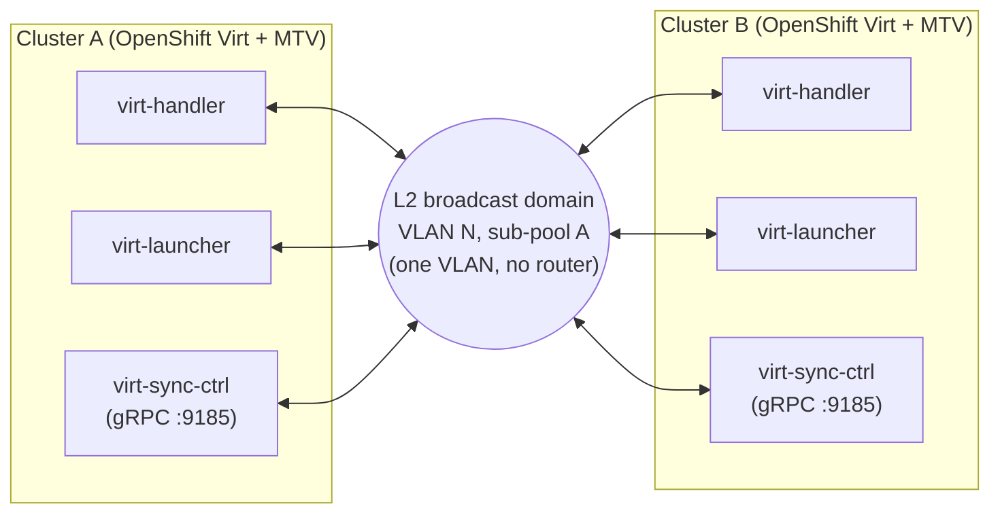

# Cross-Cluster Live Migration (CCLM) on OpenShift Virtualization 4.21

> **How-to / KCS-style article**  
> **Audience:** OpenShift platform engineers configuring CCLM between two or more OCP clusters running KubeVirt + MTV.  
> **Validated on:** OCP 4.21.11 / 4.21.12, OpenShift Virtualization 4.21.3, MTV (Forklift) 2.11, lab with stretched-L2 across clusters.  
> **Status:** End-to-end validated 2026-05-04 (fedora + win2k22 + centos all migrated cross-cluster successfully).  

---

## 1. What this article covers

How to configure CCLM end-to-end between two CNV-enabled OpenShift clusters that share an L2 network segment (typically a VLAN trunked between switches in the same DC, or a stretched L2 fabric across DCs).

**Result:** running KubeVirt VMs can be live-migrated between clusters with no workload downtime, much like vMotion across vCenters in vSphere.

**Out of scope:**

- L3-routed migration networks across DCs (requires a router and BGP/static routing: the helper supports it but the procedure differs at the network team level).
- IPv6 / dual-stack migration networks (functional but requires extra validation; not yet recommended for production).
- HCP-hosted clusters with KubeVirt nodes (this article assumes nodes with their own hypervisor, including BareMetal HCP-hosted).

---

## 2. Architecture overview



Three components matter:

1. **Migration network**: a dedicated NAD (or CUDN-managed equivalent) carrying VLAN-tagged frames over a bridge that bonds the cluster's physical NICs. Pods on this network are virt-handler, virt-launcher, and virt-synchronization-controller.
2. **HCO `liveMigrationConfig.network`**: points KubeVirt at the migration network for ALL migrations (intra-cluster and CCLM).
3. **MTV (Forklift)** with `feature_ocp_live_migration` enabled + cross-cluster providers: orchestrates the CCLM at the workload level (Plans → Migrations).

The CCLM data path is qemu-to-qemu TCP between virt-launcher pods on the two clusters, coordinated via gRPC to virt-synchronization-controller.

---

## 3. Prerequisites

| Item | Required |
|---|---|
| Both clusters on **same OCP minor** (4.21.x) | yes: cross-minor breaks ALPN handshake (TLS) |
| Both clusters on **same CNV minor** (4.21.x) | yes |
| **OVS Balance-SLB bonded** physical NICs | yes (this article); Linux-bonded variant is more complex |
| Existing OVN bridge mapping for non-default networks | yes: typically `vmnet:br-phy` from cluster install |
| **VLAN trunked between clusters' switches**, end-to-end at MTU ≥ 1500 | yes; MTU 9000 recommended for performance |
| MTV (Forklift) operator installed on both clusters | yes |
| MTV ServiceAccount + ClusterRole on each cluster (for cross-cluster providers) | yes |
| **Address space**: a /16 (or larger) reserved as "internal CCLM-only" | yes: see [§5](#5-address-space-planning) |
| `oc` cluster-admin access to both clusters | yes |

### 3.1 Verify the bonding model

The procedure in this article assumes OVS-level bonding (the default for HCP and recent CNV installs). On any worker:

```bash
oc debug node/<worker-name> -- chroot /host bash -c '
  echo "--- bond0 (should NOT exist) ---"
  nmcli device show bond0 2>&1 | head -3
  echo "--- bridges ---"
  ovs-vsctl list-br
  echo "--- existing bridge mappings ---"
  ovs-vsctl get open_vswitch . external_ids:ovn-bridge-mappings
'
```

If `bond0` returns "Device not found" and you see `br-phy` in the bridge list, you're in the right topology.

If you have a Linux-level `bond0`, this article does NOT apply directly: you'd need a different NNCP shape (full bridge + vlan sub-interface). Consult Red Hat documentation or open a ticket.

---

## 4. The configuration in 5 steps

The procedure is the same on **both clusters** unless noted otherwise.

### Step 1: NodeNetworkConfigurationPolicy (NNCP)

Adds a new OVN bridge mapping `cclm-mig:br-phy` so OVN-K can multiplex the migration VLAN on top of the existing bonded uplink.

```yaml
apiVersion: nmstate.io/v1
kind: NodeNetworkConfigurationPolicy
metadata:
  name: cclm-migration-mapping
spec:
  nodeSelector:
    node-role.kubernetes.io/worker: ""
  desiredState:
    ovn:
      bridge-mappings:
        - bridge: br-phy
          localnet: vmnet              # preserve existing mapping (use whatever
                                       # `ovs-vsctl get open_vswitch . external_ids:ovn-bridge-mappings`
                                       # returns on your worker)
          state: present
        - bridge: br-phy
          localnet: cclm-mig           # NEW mapping for the migration network
          state: present
```

Apply, then verify:

```bash
oc apply -f cclm-nncp.yaml
oc wait --for=condition=Available nncp/cclm-migration-mapping --timeout=2m
oc get nnce  # all nodes should be Available
```

```bash
oc debug node/<worker> -- chroot /host \
  ovs-vsctl get open_vswitch . external_ids:ovn-bridge-mappings
# Expected: "vmnet:br-phy,cclm-mig:br-phy"
```

**Why this shape:** OVS Balance-SLB clusters multiplex all VLANs trunked from the switch through a single bond inside `br-phy`. To add a new logical network, you don't create a new bridge: you register another OVN bridge mapping. OVN handles VLAN tagging at egress.

### Step 2: ClusterUserDefinedNetwork (CUDN) for migration

CUDN is the modern OVN-K API for declarative network definition. It auto-generates the underlying NetworkAttachmentDefinition in matching namespaces.

This is the **per-cluster** unique configuration: each cluster gets a different `excludeSubnets` list so its OVN-K only allocates from its own sub-pool of the shared supernet.

**Use the helper** (`cclm-helper.sh`, see [§6](#6-the-cclm-helpersh-script)) to compute the `excludeSubnets` correctly. Hand-writing this list is error-prone and silently fails if any two entries overlap.

Example for cluster A using sub-pool `10.250.10.0/26` from supernet `10.250.0.0/16`:

```yaml
apiVersion: k8s.ovn.org/v1
kind: ClusterUserDefinedNetwork
metadata:
  name: cclm-migration
spec:
  namespaceSelector:
    matchLabels:
      kubernetes.io/metadata.name: openshift-cnv
  network:
    topology: Localnet
    localnet:
      role: Secondary
      physicalNetworkName: cclm-mig         # matches NNCP's localnet name
      subnets: ["10.250.0.0/16"]            # supernet → propagated as pod mask
      excludeSubnets:                       # carve every other /26 OUT
        - "10.250.0.0/21"
        - "10.250.8.0/23"
        - "10.250.10.64/26"
        - "10.250.10.128/25"
        - "10.250.11.0/24"
        - "10.250.12.0/22"
        - "10.250.16.0/20"
        - "10.250.32.0/19"
        - "10.250.64.0/18"
        - "10.250.128.0/17"
      mtu: 9000
      vlan:
        mode: Access
        access:
          id: 100                           # match the trunked VLAN
      ipam:
        mode: Enabled
        lifecycle: Persistent               # IP survives pod restart (VM-friendly)
```

Cluster B uses the same shape but a different sub-pool (e.g. `10.250.20.0/26`) and a different excludes list (computed by the helper).

Apply on each cluster:

```bash
./cclm-helper.sh render <cluster-id> | oc apply -f -
oc get clusteruserdefinednetwork cclm-migration -o jsonpath='{.status.conditions[0].type}={.status.conditions[0].status}'
# Expected: NetworkCreated=True
```

```bash
oc get net-attach-def -n openshift-cnv cclm-migration
# Expected: the auto-generated NAD exists
```

### Step 3: HyperConverged

Point KubeVirt at the migration network and enable the CCLM feature gate:

```bash
oc patch hyperconverged kubevirt-hyperconverged -n openshift-cnv --type=merge -p '
spec:
  liveMigrationConfig:
    network: cclm-migration
    completionTimeoutPerGiB: 800
    parallelMigrationsPerCluster: 5
    parallelOutboundMigrationsPerNode: 2
    progressTimeout: 150
    allowPostCopy: true
  featureGates:
    decentralizedLiveMigration: true
'
```

Wait for KubeVirt operator to roll virt-handler and virt-synchronization- controller (~1-2 min per cluster):

```bash
oc rollout status daemonset/virt-handler -n openshift-cnv
oc rollout status deployment/virt-synchronization-controller -n openshift-cnv
```

**Why these values:**
- `completionTimeoutPerGiB: 800`: generous; allows convergence of busy VMs without prematurely aborting
- `allowPostCopy: true`: enables post-copy fallback when pre-copy doesn't converge OR when initial connection has timing issues. See [§8](#8-troubleshooting) caveats.
- `decentralizedLiveMigration: true`: the CCLM feature gate (4.21 GA)

### Step 4: MTV (Forklift) feature gate + providers

On each cluster:

```bash
oc patch ForkliftController forklift-controller -n openshift-mtv --type=json \
  -p '[{"op":"add","path":"/spec/feature_ocp_live_migration","value":"true"}]'
```

Verify `virt-synchronization-controller` is running on both clusters:

```bash
oc get pods -n openshift-cnv -l kubevirt.io=virt-synchronization-controller
```

Configure cross-cluster MTV providers: each cluster needs a `Provider` pointing at the OTHER cluster's API endpoint, with a long-lived ServiceAccount token. Follow the MTV docs:

  https://docs.redhat.com/en/documentation/migration_toolkit_for_virtualization/2.11

Quick check after configuring:

```bash
oc get providers -A
# Expected: each provider shows Ready=True, Connected=True, Inventory=True
```

### Step 5: Validate

**Intra-cluster live migration first** (cheap, validates the dedicated network is wired up):

```bash
cat <<EOF | oc create -f -
apiVersion: kubevirt.io/v1
kind: VirtualMachineInstanceMigration
metadata:
  generateName: cclm-test-
  namespace: <vm-namespace>
spec:
  vmiName: <vm-name>
EOF
```

watch

```bash
oc get vmim -n <vm-namespace> -w
```

Should reach `Succeeded` in seconds-to-minutes depending on VM size. Verify the VMI moved to a different node:

```bash
oc get vmi <vm-name> -n <vm-namespace> -o jsonpath='{.status.nodeName}'
```

**Cross-cluster live migration** via MTV Plan:

```yaml
apiVersion: forklift.konveyor.io/v1beta1
kind: StorageMap
metadata: {name: cclm-storage, namespace: openshift-mtv}
spec:
  provider:
    source:      {kind: Provider, name: host,           namespace: openshift-mtv, apiVersion: forklift.konveyor.io/v1beta1}
    destination: {kind: Provider, name: <peer-provider>, namespace: openshift-mtv, apiVersion: forklift.konveyor.io/v1beta1}
  map:
    - source: {name: <source-storage-class}
      destination: {storageClass: <dest-storage-class>}
---
apiVersion: forklift.konveyor.io/v1beta1
kind: NetworkMap
metadata: {name: cclm-network, namespace: openshift-mtv}
spec:
  provider:
    source:      {kind: Provider, name: host,           namespace: openshift-mtv, apiVersion: forklift.konveyor.io/v1beta1}
    destination: {kind: Provider, name: <peer-provider>, namespace: openshift-mtv, apiVersion: forklift.konveyor.io/v1beta1}
  map:
    - source: {type: pod}
      destination: {type: pod}
---
apiVersion: forklift.konveyor.io/v1beta1
kind: Plan
metadata: {name: cclm-test-plan, namespace: openshift-mtv}
spec:
  type: live
  warm: false
  preserveStaticIPs: true
  migrateSharedDisks: true
  targetNamespace: <ns>
  targetPowerState: auto
  provider:
    source:      {kind: Provider, name: host,           namespace: openshift-mtv, apiVersion: forklift.konveyor.io/v1beta1}
    destination: {kind: Provider, name: <peer-provider>, namespace: openshift-mtv, apiVersion: forklift.konveyor.io/v1beta1}
  map:
    storage: {kind: StorageMap,   name: cclm-storage, namespace: openshift-mtv, apiVersion: forklift.konveyor.io/v1beta1}
    network: {kind: NetworkMap,   name: cclm-network, namespace: openshift-mtv, apiVersion: forklift.konveyor.io/v1beta1}
  vms:
    - id: <vm-uid>
      name: <vm-name>
      namespace: <ns>
---
apiVersion: forklift.konveyor.io/v1beta1
kind: Migration
metadata: {generateName: cclm-test-mig-, namespace: openshift-mtv}
spec:
  plan: {name: cclm-test-plan, namespace: openshift-mtv}
```

Watch the migration progress:

```bash
oc get migration -n openshift-mtv -w
```

Expected pipeline phases (in order):
1. `Initialize` → Completed
2. `PrepareTarget` → Completed
3. `Synchronization` → Running → Completed
4. `Succeeded`

VM is now Running on the destination cluster. Source VM is Stopped (intentional; can be deleted manually if no longer needed).

---

## 5. Address space planning

The migration network is **L2-isolated** by design: there is no L3 gateway on the migration VLAN. Pod IPs on this network never route beyond the VLAN. So you're free to use ANY private range you want, even one that "exists" elsewhere in your network: as long as the network team confirms no router will be configured on this VLAN.

### Sizing rules of thumb

| Per-cluster sub-pool | Hosts | Clusters in /16 | Use case |
|---|---|---|---|
| /28 (16) | 14 | 4096 | Tiny edge clusters (< 10 nodes) |
| /27 (32) | 30 | 2048 | Small clusters (10-25 nodes) |
| **/26 (64)** | **62** | **1024** | **Recommended default**: covers up to ~50-node clusters comfortably |
| /25 (128) | 126 | 512 | Larger clusters (50-100 nodes) |
| /24 (256) | 254 | 250 | Very large clusters |

A cluster needs roughly `(N + M + 1)` IPs simultaneously where N=node count (1 per virt-handler) and M=concurrent migrations (1 per dest virt-launcher) plus 1 for the leader sync-controller.

A 60-node cluster doing 5 concurrent migrations needs ~66 IPs → /26 is tight; bump to /25.

### Example pool plan

```bash
supernet:   10.250.0.0/16   (~64K IPs, dedicated to CCLM, never routed)
block_size: 26              (62 hosts per cluster)
capacity:   1024 clusters
```

```bash
Pool starting from 10.250.0.0/26 then 10.250.0.64/26 then ...
Helper picks next free; you can override with explicit allocate args
if you want to reserve specific blocks.
```

---

## 6. The cclm-helper.sh script

A self-contained shell script (in this directory) that:

- Maintains allocations in a ConfigMap on the hub cluster
- Computes `excludeSubnets` lists via the recursive carve-out algorithm
- Renders ready-to-apply CUDN manifests for both `stretched_l2` and `l3_routed` network models

### Quick start

Initialize the pool (run once on the hub)

```bash
KUBECONFIG=<hub-kubeconfig> ./cclm-helper.sh init 10.250.0.0/16 26 100
```

Allocate per cluster

```bash
./cclm-helper.sh allocate hosting-cluster-1
./cclm-helper.sh allocate hosted-cluster-a
./cclm-helper.sh allocate hosted-remote-site-1
```

List current state

```bash
./cclm-helper.sh list
```

Render a cluster's CUDN (stdout)

```bash
./cclm-helper.sh render hosting-cluster-1 > cudn-hosting.yaml
```

Apply on the target cluster (separate kubeconfig)

```bash
KUBECONFIG=<target-kubeconfig> oc apply -f cudn-hosting.yaml
```

Decommission a cluster

```bash
./cclm-helper.sh release hosted-remote-site-1
```

### Why the helper exists

Computing the `excludeSubnets` carve-out for a single /26 sub-pool out of a /16 supernet requires bisection of CIDR space: 10 entries per allocation, must be non-overlapping (OVN-K rejects overlaps with a confusing error). Hand-writing this is fragile.

The helper isolates this complexity behind `allocate` + `render`. The `cclm` role in `hypershift-automation` wraps these calls into an idempotent Ansible role; the state model (ConfigMap) and CUDN shape don't change.

---

## 7. Decisions and rationale

### 7.1 Why CUDN instead of raw NAD

Raw NetworkAttachmentDefinition uses an opaque JSON string in `spec.config`. CUDN is typed YAML, schema-validated, with these advantages:

- Schema enforces required fields (role, physicalNetworkName, etc.)
- VLAN is first-class (`vlan.access.id`) instead of inline JSON
- `ipam.lifecycle: Persistent` is built-in for VM IP persistence
- Cluster-scoped + namespaceSelector → one CUDN can serve many namespaces (auto-generates NAD per match)
- Red Hat's recommended path on OCP 4.21+

The auto-generated NAD has the same name as the CUDN (so it's still queryable as `oc get net-attach-def cclm-migration -n openshift-cnv`).

### 7.2 Why supernet pattern (instead of per-cluster /24 with L3)

The supernet trick exploits the fact that:

- `subnets: 10.250.0.0/16` propagates `/16` mask to pods
- Pods see the entire `/16` as on-link → ARP works to any IP in /16
- `excludeSubnets` constrains where IPAM allocates from, but doesn't change the pod mask

Result: each cluster's pods are in a unique sub-pool, but **on the same L2 broadcast domain**, so they reach each other via plain ARP without any router.

Alternative approaches considered:
- **Single shared `/24` (lab default):** UNSAFE. Each cluster's IPAM is independent → IP collision inevitable at scale → silent split-brain on CCLM (false-success migrations with cold-boot on destination).
- **Per-cluster `/24` + L3 routing:** valid but requires network team to provision routing for every new cluster: high coordination cost as fleet grows.
- **IPv6 ULA dual-stack:** strategically attractive but operationally immature; team needs IPv6 knowledge that's still being built.

The supernet pattern wins because it requires **zero network team coordination** beyond initial VLAN trunking, scales to thousands of clusters, and stays IPv4 (familiar).

### 7.3 Why `ipam.lifecycle: Persistent`

This pairs with `IPAMClaim` CRs (already present in the cluster) so that when a virt-launcher pod is restarted (e.g. node drain, OOM kill), the new pod gets the SAME IP. For VMs this means the migration network endpoints are stable across recycles: reduces the chance of CCLM failures from cached endpoints pointing to stale IPs.

### 7.4 Why `allowPostCopy: true`

Without post-copy, if pre-copy fails to converge OR if there's a transient connection issue at the start of qemu state transfer, the migration aborts and the source VM remains running (safe but failed).

With post-copy, KubeVirt falls back to copying remaining memory pages on-demand from the source after switching the VM CPU to the destination. This handles:

- VMs with high memory dirty rates (busy DBs, in-memory caches)
- Initial-connection race conditions (we observed this with centos-stream9)

Risk: if the network goes down during post-copy, the VM is split between source (no CPU state) and dest (incomplete memory) → data corruption risk. This is acceptable on a stable, dedicated migration network. NOT acceptable over flaky links.

If migrating over an unreliable network (offshore, VPN), set `allowPostCopy: false` and tune `progressTimeout` + `bandwidthPerMigration` instead.

### 7.5 Why blue-green deploy of the CUDN

Creating a new CUDN with a different name (e.g. `cclm-migration-v2`) side-by-side with the legacy NAD lets you:

- Roll back instantly via HCO patch (single field)
- Test the new network before committing
- Avoid a "no NAD" window during the cutover

After several days of confidence with the new network, delete the legacy NAD.

---

## 8. Troubleshooting

### 8.1 `failed to reserve IP X.X.X.X: provided IP is already allocated`

OVN-K rejected your `excludeSubnets` because two entries overlap. The helper computes them correctly; if you wrote them by hand, use the helper instead. Algorithm in `cclm-helper.sh` `carve_excludes` function.

### 8.2 CUDN spec is immutable

CUDN's `spec.network` cannot be modified. To change supernet, sub-pool, VLAN, or any field: delete the CUDN, wait for finalizer to drain pods using the underlying NAD, then recreate with new spec. This is a **maintenance window** acdc1y: in-flight migrations will abort.

### 8.3 Pods stuck in ContainerCreating with `failed to get pod annotation`

Usually means OVN-K is rejecting the network attachment. Check OVN-K controller logs:

```bash
oc logs -n openshift-ovn-kubernetes -l app=ovnkube-node --tail=100 \
  --all-containers --prefix=true | grep -iE "failed|error|udn|cclm"
```

Look for "failed to start network": usually a config problem (overlapping excludes, invalid VLAN, missing physicalNetworkName).

### 8.4 ALPN handshake failure on CCLM

```
authentication handshake failed: credentials: cannot check peer:
missing selected ALPN property
```

Both clusters must be on the **same OCP minor**. CCLM is GA in 4.21 with hardened TLS that requires ALPN. 4.20 (Tech Preview) doesn't advertise ALPN → 4.21 client refuses 4.20 server.

Fix: align both clusters to the same minor. Patch level can drift slightly but minor must match.

### 8.5 Forklift Plan reports `Succeeded=True` but VM didn't migrate

Symptoms:
- MTV says success
- Source VM still Running
- Destination VM stuck Starting / CrashLoopBackOff
- Destination virt-launcher logs show "migration finalized" + cold-boot signature (PreStartHook execution)

This is split-brain, three possible upstream causes:

1. **IP collision**: two pods got the same IP from independent IPAM. Fixed by the supernet pattern in this article.
2. **Mid-PreCopy RST**: qemu data path got reset. Possible causes: jumbo MTU not end-to-end, middlebox conntrack drop. Check `tcpdump` on the migration network; reduce NAD MTU to 1500 if jumbo-uncertain.
3. **Prep-vs-listen race**: destination signals "Prepared" before qemu listener is bound, source dials too soon, libvirt caches the failure. **Mitigation: `allowPostCopy: true`** (recommended in [§4](#4-the-configuration-in-5-steps)).

Recovery sequence (works for all three causes):

1. Delete dest virt-launcher pod

```bash
KUBECONFIG=<dest> oc delete pod virt-launcher-<vm>-<suffix> -n <ns>
```

2. Delete dest VM CR (Forklift created it during PrepareTarget; it
will be recreated when the next migration is triggered)

```bash
KUBECONFIG=<dest> oc delete vm <vm-name> -n <ns>
```

3. Delete dest PVC if it didn't cascade with the VM

```bash
KUBECONFIG=<dest> oc delete pvc <vm-name> -n <ns> --ignore-not-found
```

4. Sweep stale VMIMs on both clusters

```bash
for kc in <source> <dest>; do
  KUBECONFIG=$kc oc get vmim -n <ns> -l kubevirt.io/vmi-name=<vm-name> -o name | \
    xargs -r KUBECONFIG=$kc oc delete -n <ns>
done
```

5. Source is intact and Running. Trigger a new Migration on the Plan.


### 8.6 `in-flight migration detected` webhook rejection

A previous failed migration left a VMIM in non-terminal phase. Find and delete it:

```bash
oc get vmim -n <ns> | grep -v "Succeeded\|Failed"
oc delete vmim <stale-name> -n <ns>
```

### 8.7 Forklift Plan with `Succeeded=True` won't process new Migrations

Forklift treats the Plan as "done." Either delete and recreate the Plan, or create a brand-new Plan with the same VMs.

### 8.8 Reverse migration fails with VMAlreadyExists / MacConflicts

When migrating VM X back from cluster B to A (after originally going A → B), the old VM CR on A still exists in Stopped state with the same MAC. Delete it before triggering:

```bash
KUBECONFIG=<dest-of-reverse> oc delete vm <vm-name> -n <ns>
KUBECONFIG=<dest-of-reverse> oc delete pvc <vm-name> -n <ns> --ignore-not-found
```

### 8.9 Pods on the migration NAD interface use `migration0`, not `net1`

KubeVirt sets the interface name to `migration0` via annotation. When querying pod network status:

```bash
oc get pod <virt-handler-pod> -n openshift-cnv -o json | \
  jq '.metadata.annotations["k8s.v1.cni.cncf.io/network-status"] | fromjson |
      map(select(.interface=="migration0"))[0]'
```

### 8.10 sync-controller is leader-elected

There are 2+ replicas; only the **leader** binds to port 9185. Don't hardcode IPs or test connecdc1y to a specific replica: discover via the K8s API or test all replicas. The whole sub-pool (`10.250.X.0/26`) must be cross-cluster reachable so leader failover doesn't break CCLM.

### 8.11 MTV `host` Provider missing on the local cluster

The MTV web console populates the source Provider dropdown from `Provider`
CRs in `openshift-mtv`. The local cluster's representative is the Provider
literally named `host`, auto-created by ForkliftController on initial
reconcile. On MTV 2.11.5 + OCP 4.20 this auto-creation occasionally fails:
ForkliftController reports `Successful=True` but `Provider/host` never
materialized. Result: the GUI cannot offer the local cluster as a source
for reverse migrations, blocking the workflow.

Detection:

```bash
oc get provider host -n openshift-mtv
# Error from server (NotFound): providers.forklift.konveyor.io "host" not found
```

Workaround (force the ansible-operator playbook to re-run from scratch):

```bash
oc delete pod -n openshift-mtv -l app=forklift,name=controller-manager
```

The pod is recreated by the Deployment in ~20s. The new ansible-operator
re-runs the playbook, the task `Setup default provider` creates the
missing `host` Provider, and it reaches `Ready` ~30s later.

`oc rollout restart deployment/forklift-operator -n openshift-mtv` was
observed to be accepted (`successfully rolled out`) but did NOT replace
the running pod (new ReplicaSet stayed at replica 0). Direct pod delete
is the path that worked.

See [POC §9.10](cclm-network-poc.md#910-forkliftcontroller-auto-managed-host-provider-not-created-on-the-hosting-cluster)
for full debug timeline and logs.

---

## 9. Operational notes

### 9.1 Maintenance windows

Three operations require a window where in-flight CCLM migrations will fail (but running VMs are not impacted):

1. **NAD/CUDN change**: virt-handlers re-IP. New connections work immediately after rollout completes; in-flight ones abort.
2. **HCO `liveMigrationConfig.network` change**: same as above.
3. **Patch upgrade of CNV**: virt-handler rollout.

Rollout is gradual (DaemonSet maxUnavailable defaults), so you can do this during business hours if you accept the migration-only downtime.

### 9.2 Monitoring

Watch the leader sync-controller's logs for CCLM acdc1y:

```bash
LEADER=$(oc get lease virt-synchronization-controller -n openshift-cnv \
  -o jsonpath='{.spec.holderIdentity}')
oc logs -n openshift-cnv $LEADER -f
```

Watch virt-handler logs filtered by VMI of interest:

```bash
oc logs -n openshift-cnv -l kubevirt.io=virt-handler --prefix=true \
  --all-containers -f --since=1m | grep -i <vm-name>
```

### 9.3 Capacity planning

```
Per cluster IPs needed = nodes + concurrent_migrations + 1
                       (virt-handlers)  (virt-launchers)  (sync-ctrl)
```

A 20-node cluster doing 5 concurrent migrations needs 26 IPs.
- /27 (30 IPs) is comfortable
- /26 (62 IPs) is generous

When a cluster outgrows its sub-pool:
1. Stop CCLM-related operations
2. Release the cluster's allocation
3. Manually allocate a larger block (e.g. `--block-size=25` next time)
4. Re-render and apply

This is one reason to start with /26 even for small clusters: head- room for growth without re-allocation.

### 9.4 Cleanup of legacy NAD after CUDN cutover

After several days of confidence with the new CUDN-managed NAD:

```bash
oc delete net-attach-def cclm-migration-legacy -n openshift-cnv
```

Verify nothing else referenced it (the auto-generated NAD from CUDN has the same name `cclm-migration` if you kept the convention).

---

## 10. References

- POC reference doc: `cclm-network-poc.md` (this repo)
- Validated config audit: `cclm-config-audit.md` (this repo)
- Helper script: `cclm-helper.sh` (this repo)
- OKD 4.21 CCLM docs:
  - https://docs.okd.io/4.21/virt/live_migration/virt-enabling-cclm-for-vms.html
  - https://docs.okd.io/4.21/virt/live_migration/virt-configuring-cross-cluster-live-migration-network.html
- MTV (Forklift) 2.11 docs:
  - https://docs.redhat.com/en/documentation/migration_toolkit_for_virtualization/2.11
- OVN-K UserDefinedNetwork:
  - https://docs.openshift.com/container-platform/4.21/networking/multiple_networks/configuring-additional-network.html
  (CUDN section)

---

## 11. Validated lab end state (reference)

| Field | Hosting (hosting-cluster-1) | Hosted (hosted-cluster-a) |
|---|---|---|
| OCP version | 4.21.11 | 4.21.12 |
| CNV version | 4.21.3 | 4.21.3 |
| Sub-pool | 10.250.10.0/26 | 10.250.20.0/26 |
| VLAN | 100 | 100 |
| Network model | stretched_l2 | stretched_l2 |
| HCO `network` | cclm-migration-v2 | cclm-migration-v2 |
| HCO `allowPostCopy` | true | true |
| HCO `decentralizedLiveMigration` | true | true |
| Forklift `feature_ocp_live_migration` | true | true |

Cross-cluster migrations validated:
- fedora-vm-01 (hosting → hosted): SUCCESS in 110s
- centos-vm-01 (hosted → hosting): SUCCESS in 110s
- (Previously failing centos case now succeeds with this configuration)
