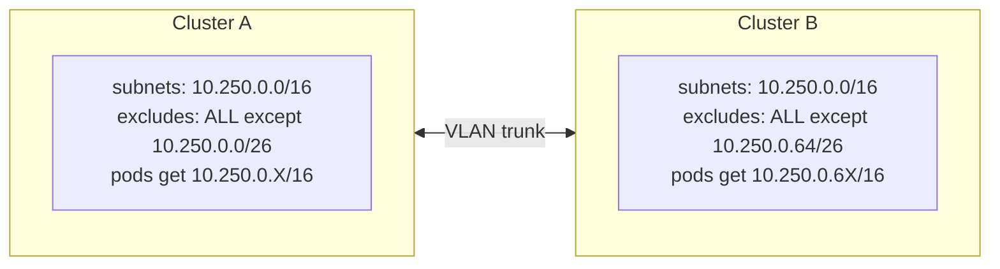

# Configuring Cross-Cluster Live Migration (CCLM) on OpenShift Virtualization (4.20 Tech Preview / 4.21+ GA)

## Issue

Configure CCLM between two CNV-enabled OCP clusters sharing an L2 network segment (typical lab or single-DC scenario), with no IP collisions and no L3 routing required between clusters.

## Environment

| Component | Version (validated) |
|---|---|
| OpenShift | 4.20.x or 4.21.x. **Both clusters MUST be on the same minor.** Mixing minors causes TLS handshake to fail with `missing selected ALPN property` (see Troubleshooting). |
| OpenShift Virtualization | 4.20.x (CCLM as Tech Preview) or 4.21.x (CCLM GA). Both clusters on the same minor. |
| Migration Toolkit for Virtualization (Forklift) | 2.11.5 |
| Bonding model | OVS Balance-SLB (`br-phy`) used in validation. Other bonding modes / bridges work; see callout below. |
| Network | Shared VLAN trunked between clusters' switches, MTU >= 1500 (9000 recommended) |

> **CNV 4.20 vs 4.21 in this procedure.** CNV 4.20 ships CCLM as Tech
> Preview. The HyperConverged CRD on 4.20 does not expose the
> `featureGates.decentralizedLiveMigration` gate (only present from
> 4.21+). The network path works the same on both versions; the
> explicit gate is simply not available on 4.20. Step 4 below has two
> variants accordingly. This procedure was validated by Red Hat in lab
> on both 4.20.x and 4.21.x. For GA support use 4.21+.
>
> **Do not mix minors between clusters.** Source and destination must
> both be 4.20.x or both be 4.21.x. A mixed pair fails handshake at
> the migration TLS layer; not a configuration problem, a known cross-minor incompatibility.
>
> **Bonding model: example, not requirement.** This procedure was
> developed and validated on OVS Balance-SLB with the OVS bridge
> `br-phy`, which is the bonding model used by the lab where the
> material was produced. CCLM is independent of the bonding choice;
> any working OVN bridge will do. If your environment uses a
> different bridge (for example `br-vmdata`) and/or a different
> bonding mode (LACP / 802.3ad, balance-xor, active-backup,
> linux-bond, etc.), substitute `br-phy` accordingly in the NNCP
> bridge mappings (Step 1) and in the OVN bridge mappings
> prerequisite below. The migration VLAN must be trunked on whatever
> uplink the chosen bridge attaches to. The NNCP and CUDN remain the
> same; only the bridge name changes.

## Prerequisites

- Cluster-admin on both clusters.
- OVN bridge mappings already include the cluster's existing `<name>:br-phy` (typically `vmnet:br-phy` from install).
- A `/16` (or larger) IPv4 range reserved as "CCLM-internal, never routed", for example `10.250.0.0/16`.
- Migration VLAN ID agreed (lab default: 100).
- MTV operator installed on both clusters.
- Cross-cluster MTV `Provider` CRs configured and `Ready=True`.

## Resolution

Apply on **both** clusters unless noted. Each cluster's CUDN uses a different sub-pool of the same supernet.

### Step 1: NodeNetworkConfigurationPolicy (NNCP)

Adds an OVN bridge mapping for the migration VLAN. Both clusters, identical content:

```yaml
apiVersion: nmstate.io/v1
kind: NodeNetworkConfigurationPolicy
metadata:
  name: cclm-migration-mapping
spec:
  nodeSelector:
    node-role.kubernetes.io/worker: ""
  desiredState:
    ovn:
      bridge-mappings:
        - { bridge: br-phy, localnet: vmnet,    state: present }
        - { bridge: br-phy, localnet: cclm-mig, state: present }
```

The `vmnet` entry preserves the existing mapping installed by the cluster bootstrap. The `cclm-mig` entry is the new one for migration. Apply and wait:

```bash
oc apply -f cclm-nncp.yaml
oc wait --for=condition=Available nncp/cclm-migration-mapping --timeout=2m
```

### Step 2: Allocate sub-pools and render the CUDN

Use `cclm-helper.sh` from this repo. Run it on the hub cluster (any cluster you have admin on; the helper just stores state in a ConfigMap there).

Initialize the pool once per fleet:

```bash
KUBECONFIG=<hub> ./cclm-helper.sh init 10.250.0.0/16 26 100
```

Allocate one sub-pool per cluster:

```bash
KUBECONFIG=<hub> ./cclm-helper.sh allocate hosting-cluster-1
KUBECONFIG=<hub> ./cclm-helper.sh allocate hosted-cluster-a
KUBECONFIG=<hub> ./cclm-helper.sh list
```

The first `allocate` returns `10.250.0.0/26`, the second `10.250.0.64/26`, and so on. The list command prints the current state as a sanity check.

### Step 3: Apply the CUDN to each cluster

Render on the hub, pipe to `oc apply` on each target:

```bash
KUBECONFIG=<hub> ./cclm-helper.sh render hosting-cluster-1 | KUBECONFIG=<cluster-A> oc apply -f -
KUBECONFIG=<hub> ./cclm-helper.sh render hosted-cluster-a  | KUBECONFIG=<cluster-B> oc apply -f -
```

The CUDN auto-generates a `NetworkAttachmentDefinition` named `cclm-migration` in `openshift-cnv` on each cluster.

### Step 4: HyperConverged

Two variants depending on the CNV version on each cluster. Check first:

```bash
oc get csv -n openshift-cnv | grep kubevirt-hyperconverged-operator
```

Confirm whether the `decentralizedLiveMigration` field is exposed by the running HCO CRD:

```bash
oc get crd hyperconvergeds.hco.kubevirt.io -o yaml \
  | yq '.spec.versions[] | select(.name=="v1beta1")
        | .schema.openAPIV3Schema.properties.spec.properties.featureGates.properties
        | has("decentralizedLiveMigration")'
```

`true` on CNV 4.21+ (GA), `false`/missing on CNV 4.20 (Tech Preview).

**Variant A: CNV 4.21+ (CCLM is GA).** Patch network + feature gate:

```bash
oc patch hyperconverged kubevirt-hyperconverged -n openshift-cnv --type=merge -p '
spec:
  liveMigrationConfig:
    network: cclm-migration
    completionTimeoutPerGiB: 800
    parallelMigrationsPerCluster: 5
    parallelOutboundMigrationsPerNode: 2
    progressTimeout: 150
    allowPostCopy: true
  featureGates:
    decentralizedLiveMigration: true
'
```

**Variant B: CNV 4.20 (CCLM is Tech Preview).** The `decentralizedLiveMigration` field is not in the HCO CRD on 4.20. Patch only the network and migration tunables:

```bash
oc patch hyperconverged kubevirt-hyperconverged -n openshift-cnv --type=merge -p '
spec:
  liveMigrationConfig:
    network: cclm-migration
    completionTimeoutPerGiB: 800
    parallelMigrationsPerCluster: 5
    parallelOutboundMigrationsPerNode: 2
    progressTimeout: 150
    allowPostCopy: true
'
```

Trying to patch `featureGates.decentralizedLiveMigration` on 4.20 gets rejected by the HCO admission webhook (`unknown field`).

The KubeVirt operator rolls `virt-handler` (DaemonSet) and `virt-synchronization-controller` (Deployment) automatically, taking 1-2 minutes per cluster.

### Step 5: MTV feature gate

On both clusters. The value **must be a bool** (`true`), not the string `"true"`:

```bash
oc patch ForkliftController forklift-controller -n openshift-mtv --type=json \
  -p '[{"op":"add","path":"/spec/feature_ocp_live_migration","value":true}]'
```

> **Watch out: string-vs-bool trap.** The ForkliftController CR
> accepts the patch with `"value":"true"` (string) without error, but
> the operator does not treat the string as truthy. The
> `feature_ocp_live_migration` flag stays effectively off and
> cross-cluster migrations fail silently later. Always pass the bool.
> Verification command (must return `true`, not `"true"`):
>
> ```bash
> oc get ForkliftController forklift-controller -n openshift-mtv \
>   -o jsonpath='{.spec.feature_ocp_live_migration}{"\n"}'
> ```

## Verification

Run the following on each cluster.

NNCP applied on every node (expected: all `Available`):

```bash
oc get nnce | grep cclm-migration-mapping
```

CUDN ready (expected: `NetworkCreated=True`):

```bash
oc get clusteruserdefinednetwork cclm-migration \
  -o jsonpath='{.status.conditions[0].type}={.status.conditions[0].status}{"\n"}'
```

Underlying NAD generated:

```bash
oc get net-attach-def -n openshift-cnv cclm-migration
```

`virt-handler` pods got IPs from the cluster's sub-pool (expected: every pod has an IP in this cluster's sub-pool, mask `/16`):

```bash
oc get pods -n openshift-cnv -l kubevirt.io=virt-handler -o json | \
  jq -r '.items[] | "\(.metadata.name) " +
    (((.metadata.annotations["k8s.v1.cni.cncf.io/network-status"] // "[]") | fromjson) |
     map(select(.interface=="migration0"))[0].ips // ["NONE"] | tostring)'
```

HCO bound to the CUDN (expected: `cclm-migration`):

```bash
oc get hyperconverged kubevirt-hyperconverged -n openshift-cnv \
  -o jsonpath='{.spec.liveMigrationConfig.network}{"\n"}'
```

CCLM feature gate (expected: `true`):

```bash
oc get hyperconverged kubevirt-hyperconverged -n openshift-cnv \
  -o jsonpath='{.spec.featureGates.decentralizedLiveMigration}{"\n"}'
```

`virt-synchronization-controller` ready, leader bound to `:9185`:

```bash
oc get pods -n openshift-cnv -l kubevirt.io=virt-synchronization-controller
oc get lease virt-synchronization-controller -n openshift-cnv \
  -o jsonpath='{.spec.holderIdentity}{"\n"}'
```

MTV feature gate (expected: `true`):

```bash
oc get ForkliftController forklift-controller -n openshift-mtv \
  -o jsonpath='{.spec.feature_ocp_live_migration}{"\n"}'
```

Cross-cluster L2 reachability: from a `virt-handler` pod on cluster A, ping `virt-handler` on cluster B via the `migration0` interface. Use a netshoot or support-tools pod attached to `cclm-migration` if `virt-handler` doesn't ship `ping`.

End-to-end test, intra-cluster first, then cross-cluster:

```bash
cat <<EOF | oc create -f -
apiVersion: kubevirt.io/v1
kind: VirtualMachineInstanceMigration
metadata: {generateName: cclm-test-, namespace: <ns>}
spec: {vmiName: <vm-name>}
EOF

oc get vmim -n <ns> -w
```

Expected: `phase=Succeeded` in seconds-to-minutes for the intra-cluster case. For cross-cluster, trigger an MTV `Plan` of `type: live` and watch the resulting `Migration` and `VirtualMachineInstanceMigration`.

## Architecture reference



Pod mask equals the supernet mask (/16), so cross-cluster IPs are on-link via ARP. Pod IP allocation is restricted to a per-cluster sub-pool (/26), so there are no collisions.

## Troubleshooting

| Symptom | Cause | Fix |
|---------|-------|-----|
| `failed to reserve IP X.X.X.X: provided IP is already allocated` | `excludeSubnets` entries overlap. | Use `cclm-helper.sh render` (computes algorithmically). Don't hand-write. |
| Pods stuck `ContainerCreating`, `failed to get pod annotation` | OVN-K rejected the network. Check `oc logs -n openshift-ovn-kubernetes -l app=ovnkube-node` for "failed to start network". | Fix CUDN config (overlapping excludes, invalid VLAN, wrong `physicalNetworkName`). |
| `authentication handshake failed: missing selected ALPN property` | OCP minor mismatch between clusters (e.g. 4.20 vs 4.21). | Align both clusters to the same OCP minor. |
| MTV `Migration` reports `Succeeded=True`, source VM still `Running`, dest stuck `Starting` | Split-brain. Three possible causes: IP collision, mid-PreCopy RST, or prep-vs-listen race. | Configuration in this article eliminates IP collision; `allowPostCopy: true` mitigates the race. See Recovery below. |
| `admission webhook ... in-flight migration detected` | Stale VMIM in non-terminal phase from a prior attempt. | `oc delete vmim <name> -n <ns>` on both clusters. |
| Reverse migration: `VMAlreadyExists`, `MacConflicts` | Old VM CR persists on the destination from a prior migration in the other direction. | `oc delete vm <name> -n <ns>` on the new dest before migrating. |
| Forklift `Plan` with `Succeeded=True` ignores new `Migration` CRs | Plan is treated as done; no native retry. | Delete and recreate the Plan, or create a new one. |
| CUDN spec change rejected: `spec.network: Invalid value: object: Network spec is immutable` | CUDN spec is immutable by design. | Delete the CUDN, wait for the finalizer to drain pods, recreate with the new spec (maintenance window). |
| Pod's secondary interface not named `net1` as expected | KubeVirt names it `migration0` via annotation `k8s.v1.cni.cncf.io/networks: <name>@migration0`. | Use `interface=="migration0"` in jq queries. |
| TCP `:9185` refused on a sync-controller IP, but ICMP works | Replica is a follower (leader-elected); only the leader binds `:9185`. | Discover the leader via `oc get lease virt-synchronization-controller -n openshift-cnv`. |
| Cannot select local cluster as source Provider in MTV Plan creation UI | The auto-managed `Provider/host` is missing on this cluster. Confirmed on MTV 2.11.5 + OCP 4.20 / 4.21: ForkliftController sometimes fails to create the `host` Provider on initial reconcile. Full debug timeline in [`cclm-network-poc.md` §9.10](cclm-network-poc.md). | Restart the operator pod to force the ansible-operator playbook to re-run: `oc delete pod -n openshift-mtv -l app=forklift,name=controller-manager`. `oc rollout restart` of the deployment was observed to be accepted but not effective. The `host` Provider appears ~30s later. |
| Step 5 patch accepted, but `feature_ocp_live_migration` reads back as `"true"` (string) and migrations still fail | The `value` in the JSON patch was passed as a string. ForkliftController accepts the type without error but does not treat the string as truthy. | Repatch with bool: `-p '[{"op":"replace","path":"/spec/feature_ocp_live_migration","value":true}]'`. Verify with the jsonpath query in Step 5 returns `true`, not `"true"`. |

### Split-brain recovery

Delete the dest virt-launcher pod:

```bash
KUBECONFIG=<dest> oc delete pod virt-launcher-<vm>-<suffix> -n <ns>
```

Delete the dest VM CR (Forklift recreates it on the next migration trigger):

```bash
KUBECONFIG=<dest> oc delete vm <vm-name> -n <ns>
```

Sweep stale VMIMs on both clusters:

```bash
for kc in <source> <dest>; do
  KUBECONFIG=$kc oc get vmim -n <ns> -l kubevirt.io/vmi-name=<vm-name> -o name | \
    xargs -r KUBECONFIG=$kc oc delete -n <ns>
done
```

The source VM is intact and `Running`. Re-trigger the Plan via a new Migration.

## Key decisions (one-line each)

- **CUDN over raw NAD**: typed YAML, schema-validated, `ipam.lifecycle: Persistent` for VM IP stability.
- **Supernet pattern**: single `/16` propagated as pod mask + per-cluster sub-pool via `excludeSubnets`. Cross-cluster L2 reachability without a router, no IP collisions.
- **`allowPostCopy: true`**: covers the initial-connection race and high-dirty-rate VMs. Only safe on stable migration networks.
- **Blue-green CUDN deploy** (e.g. `cclm-migration-v2`): instant rollback via a single HCO patch.
- **L2-isolated address space**: the migration VLAN has no router, so any private range is safe regardless of conflicts elsewhere.

## Diagnostic command

Dump all CCLM-relevant config from both clusters in one shot:

```bash
for kc in <source> <dest>; do
  echo "=== $kc ==="
  KUBECONFIG=$kc oc get nnce | grep cclm
  KUBECONFIG=$kc oc get clusteruserdefinednetwork cclm-migration -o jsonpath='{.status.conditions[0]}' | jq .
  KUBECONFIG=$kc oc get hyperconverged kubevirt-hyperconverged -n openshift-cnv \
    -o jsonpath='{.spec.liveMigrationConfig}' | jq .
  KUBECONFIG=$kc oc get pods -n openshift-cnv -l kubevirt.io=virt-handler -o json | \
    jq -r '.items[] | "\(.metadata.name) ip=" +
      (((.metadata.annotations["k8s.v1.cni.cncf.io/network-status"] // "[]") | fromjson) |
       map(select(.interface=="migration0"))[0].ips // ["NONE"] | tostring)'
  KUBECONFIG=$kc oc get providers -n openshift-mtv \
    -o custom-columns=NAME:.metadata.name,READY:.status.conditions[?\(@.type==\"Ready\"\)].status,URL:.spec.url
  KUBECONFIG=$kc oc get ForkliftController forklift-controller -n openshift-mtv \
    -o jsonpath='feature_ocp_live_migration={.spec.feature_ocp_live_migration}{"\n"}'
done
```

## Related

- [`cclm-howto.md`](cclm-howto.md): long-form how-to with rationale and architectural context.
- [`cclm-config-audit.md`](cclm-config-audit.md): full session audit (gotchas, debug trail, all findings).
- [`cclm-helper.sh`](cclm-helper.sh): IPAM allocation helper (`init`/`list`/`allocate`/`release`/`render`).
- [`hypershift-automation` repo, role `cclm`](https://github.com/Hypershift-Automation/hypershift-automation): automated Phase A (NNCP/CUDN/IPAM via cclm-helper) and Phase B (HCO + ForkliftController patches), idempotent. Schema-adaptive: same role works on 4.20 (Tech Preview, network-only patch) and 4.21+ (GA, network + feature gate).
- [`hypershift-automation` repo, role `cclm-providers`](https://github.com/Hypershift-Automation/hypershift-automation): automated Phase C. Discovers peers from the `cclm-pool` ConfigMap and builds the full mesh of MTV `Provider`/`Secret` pairs across the fleet (`N*(N-1)`), with scoped ClusterRole and long-lived SA tokens. Idempotent. Replaces the manual procedure historically documented in `cclm-howto.md` §8.
- [`hypershift-automation/scripts/cclm-preflight-migration.sh`](https://github.com/Hypershift-Automation/hypershift-automation/blob/main/scripts/cclm-preflight-migration.sh): pre-flight and auto-cleanup of the known retry blockers (orphan VMIMs, VM/VMI stubs, finalizer-stuck VMIMs). Recommended first step on any stuck migration.
- OKD 4.21 docs: <https://docs.okd.io/4.21/virt/live_migration/>
- MTV 2.11: <https://docs.redhat.com/en/documentation/migration_toolkit_for_virtualization/2.11>
